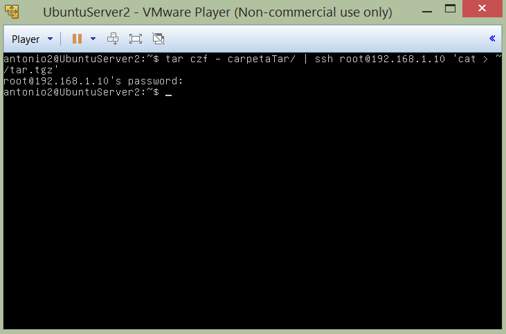
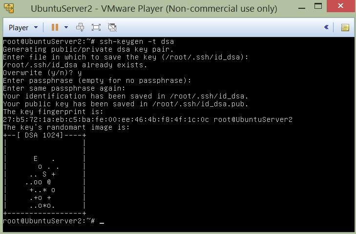
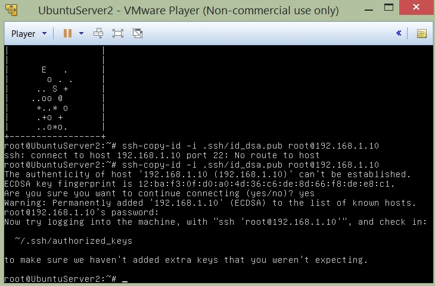
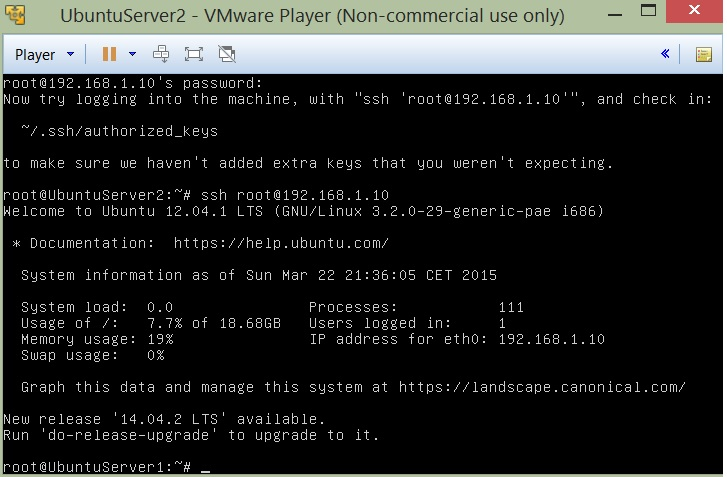
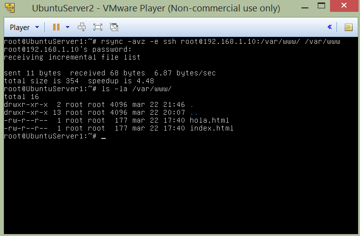
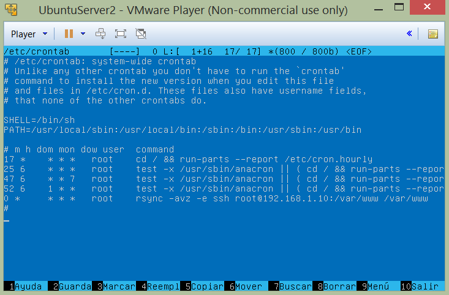

#Práctica 2

0. ##Estructura del entorno virtual.
	**Maquina de producción:** *192.168.1.10*

	**Maquina de respaldo:** *192.168.1.20*

1. ###Crear un tar con ficheros locales en un equipo remoto
	**Lo haremos mediante la orden:**

	`$> tar czf - directorio | ssh equipodestino 'cat > ~/tar.tgz'`

	

2. ###Instalar la herramienta rsync
	**Seguiremos las siguientes ordenes:**
	
	**Instalando RSYNC** *(en este caso ya venia instalada).*

	`$> sudo apt-get install rsync`
	
	**Haciendo la sincronización entre los directorios sincronizando unicamente los cambios y evitando sincronizar los logs.**
	```
	rsync -avz --delete --exclude=**/stats --exclude=**/error --exclude=**/files/pictures -e ssh -l 
	root" root@192.168.1.10:/var/www/ /var/www/
	```
4. ###Acceso sin contraseña para ssh
	**Para poder realizar la sincronización sin ser necesario autenticarse mediante el uso de contraseña seguiremos los siguientes pasos:**
	
	`$> ssh-keygen -t dsa`
	
	

	

	**Copiaremos el certificado en el servidor remoto para poder realizar la operacion rsync sin necesidad de  autenticarse mediante 
	el uso de contraseña**

	`$> ssh-copy-id -i .ssh/id_dsa.pub root@192.168.1.10`

	
	
	**Haciendo una prueba de sincronizacion mediante ssh de los directorios** *WWW.*

	**Nota:** *En caso de que quisieramos usar un usuario distinto a ROOt bastaría con darle permisos R&W sobre la carpeta WWW.* 

	`$> rsync -avz -e ssh root@192.168.1.10:/var/www/ /var/www/ `
	
	

5. ###Programar tareas con crontab
	**Programaremos RSYNC para que se inicie con el sistema y de este modo automatizaremos la sincronización.**	
		
	**Editaremos el fichero** */etc/crontab* **para añadirle la entrada de RSYNC**

	


**Autores:** *Alejandro Rodríguez López y Antonio Cordonie Campos*
	
