#Práctica 3

0. ##Estructura del entorno virtual.

	**Maquina de balanceo:** *192.168.1.5*

1. ###Instalar nginx en Ubuntu Server.

	**Importando la clave:**

	*Nos posicionamos en el directorio tmp donde descargaremos la clave del repositorio*

	`$> cd /tmp/`

	*Obtenemos las clave del repositorio*

	`$> wget http://nginx.org/keys/nginx_signing.key`

	*La añadimos a nuestra lista de claves*

	`$> apt-key add /tmp/nginx_signing.key`

	*Ya podemos eliminarla de tmp*

	`$> rm -f /tmp/nginx_signing.key`

	
	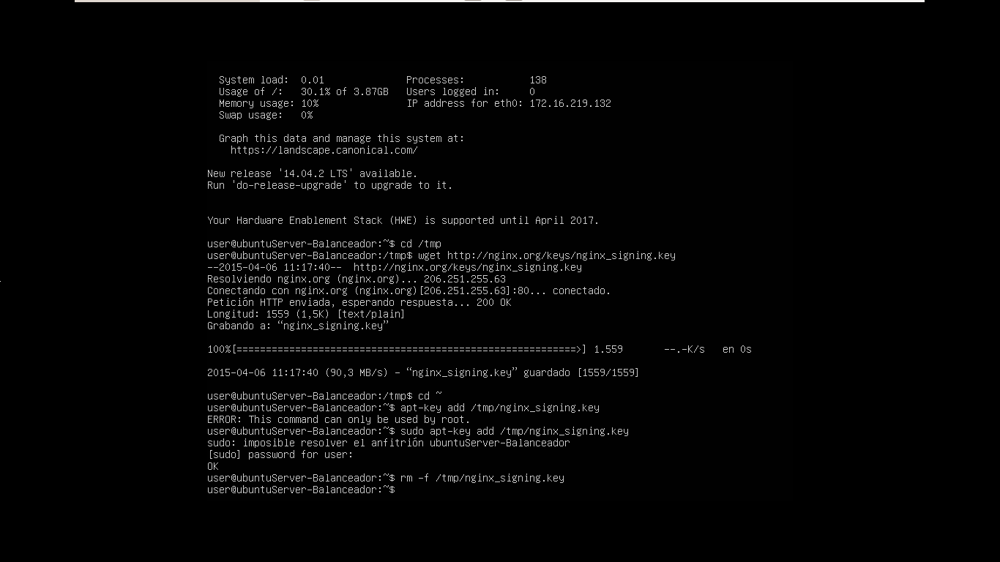

	**Añadiendo el repositorio, editando el fichero /etc/apt/sources.list**

	`$> echo "deb http://nginx.org/packages/ubuntu/ lucid nginx" >> /etc/apt/sources.list`
	
	`$> echo "deb-src http://nginx.org/packages/ubuntu/ lucid nginx" >> /etc/apt/sources.list`

	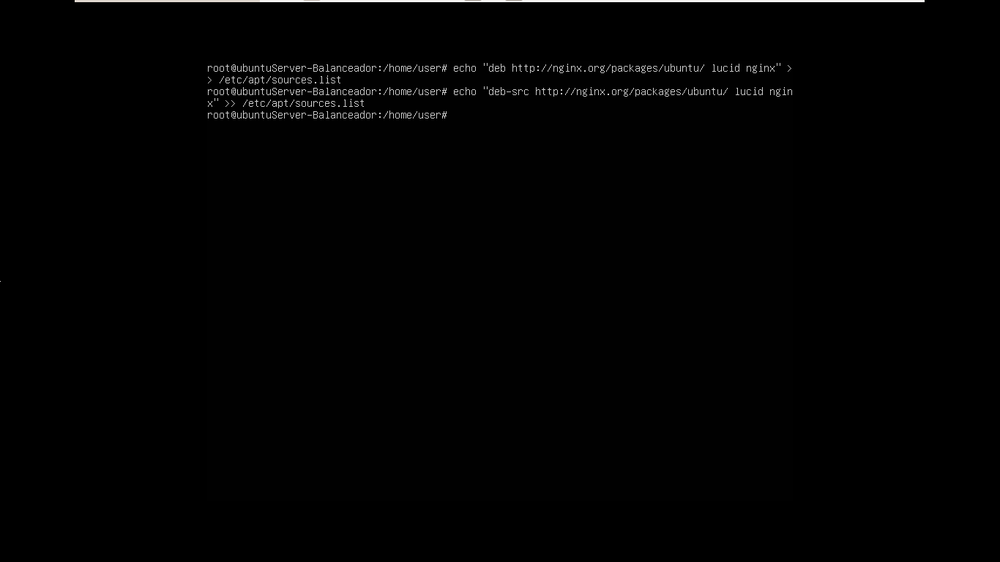

	**Instalando el paquete del nginx:**

	`$> apt-get update`
	
	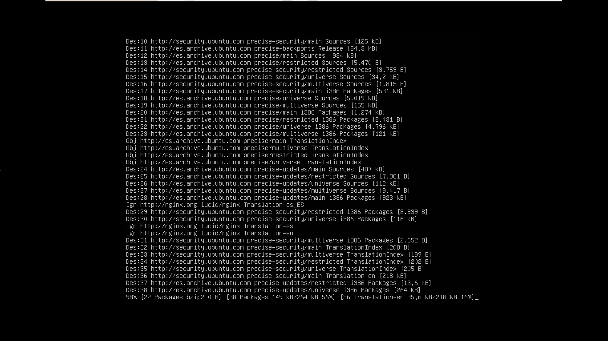

	`$> apt-get install nginx`
	
	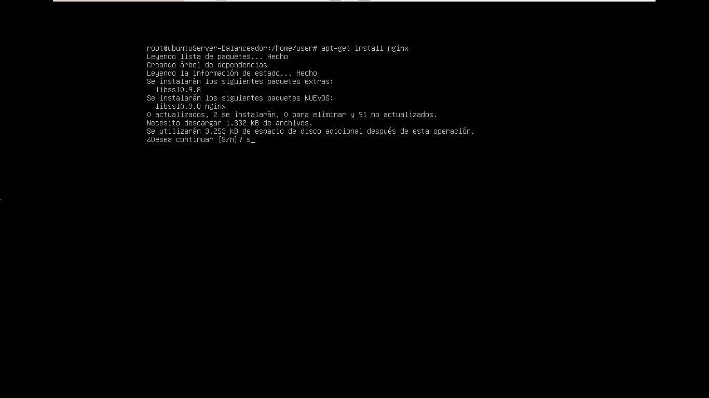

	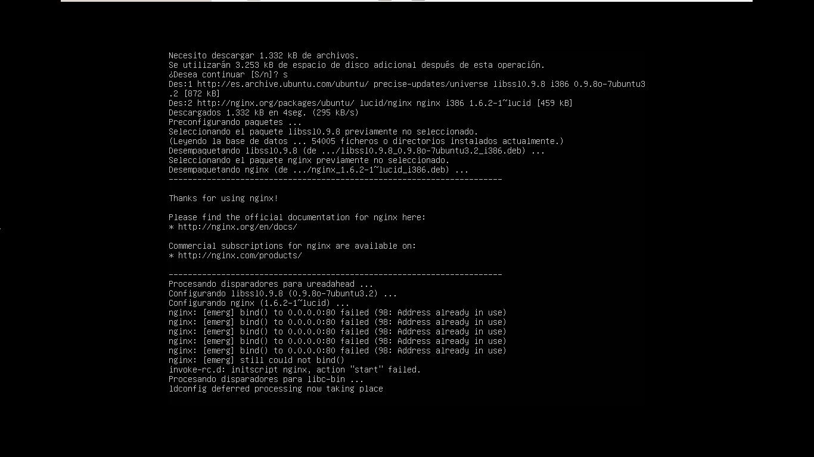

	*sí ocurriera este error es debido a que el puerto 80 esta ocupado.*

	*En este caso por apache.*

	*Podemos desinstalarlo usando:*
	
	`$> sudo service apache2 stop`

	`$> sudo apt-get purge apache2*`

	`$> sudo apt-get autoremove`

	`$> sudo rm -Rf /etc/apache2 /usr/lib/apache2 /usr/include/apache2`
	
	*Levantamos el servicio: *

	`$> sudo service nginx start`

2. ###Balanceo de carga usando nginx.

	**Configurando nginx**
	
	`$> sudo nano /etc/nginx/conf.d/default.conf`
	
	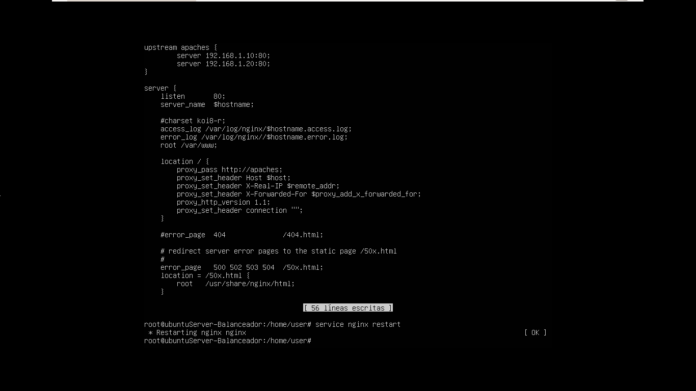

	**Configurando cargas personalizadas**	

	*Basta con añadir la carga deseada* **weight** *a cada servidor.*
	
	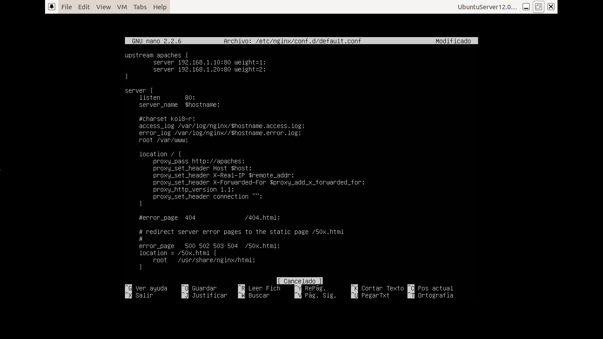

	**Configurando el trafico para que guarde fidelidad**	

	*Basta con añadir la directiva* **ip_hash** *al definir el upstream.*
	
	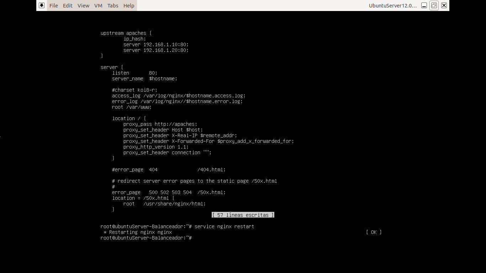
		
	**Configurando nginx para que use** *keepalive*	

	*Basta con añadir la directiva* **keepalive** *y su tiempo de vida al definir el upstream.*
	
	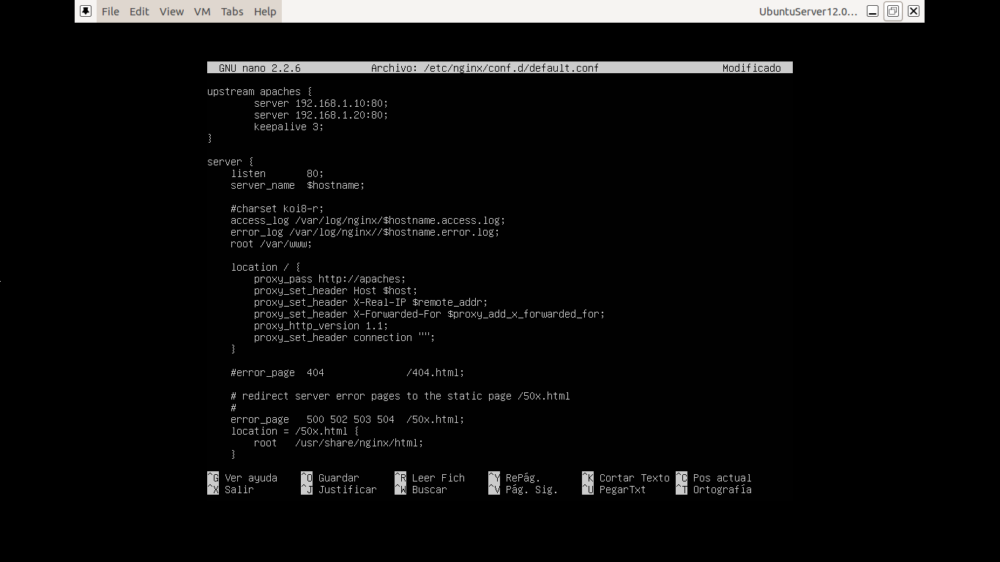
	
	**Probando nginx**
	
	`$> curl http://192.168.1.5`

	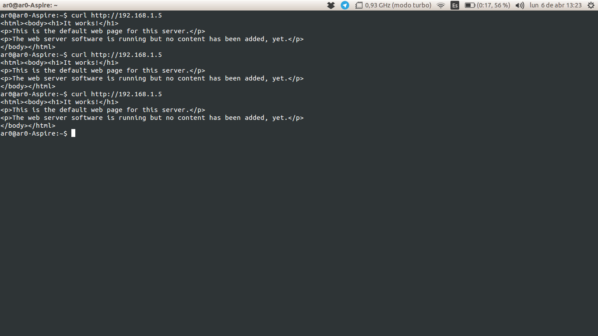

	**round-robin** 

	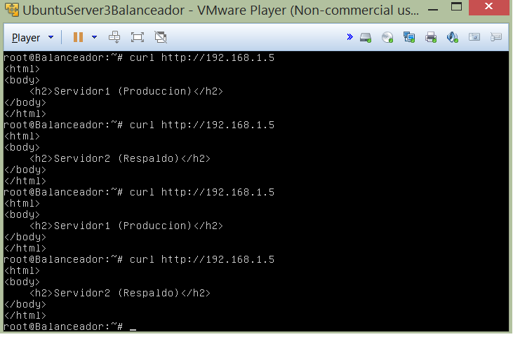

	**Usando ponderación**

	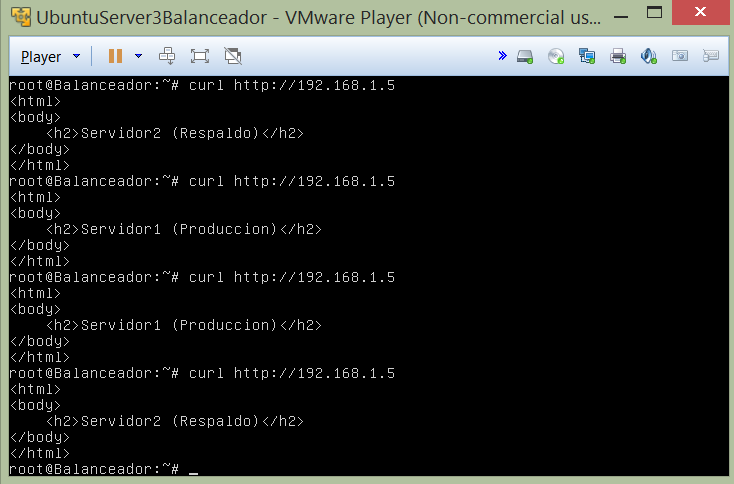

3. ###Balanceo de carga usando haproxy.
	
	**Instalando haproxy**
	
	`$> sudo apt-get install haproxy joe`

	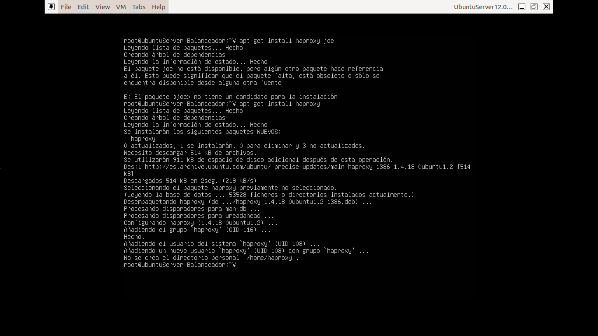

	**Configuración básica de haproxy como balanceador de carga**

	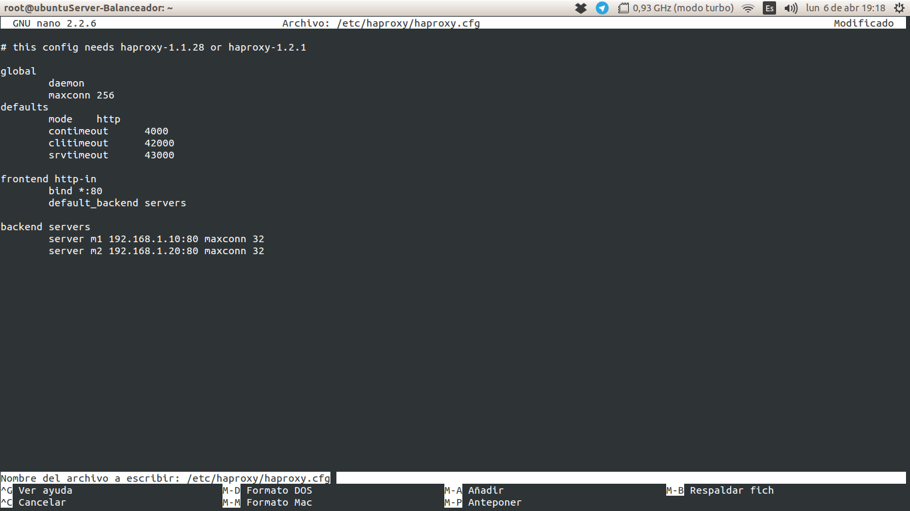
	
	**Comprobando el funcionamiento del balanceador**
	
	*Si tenemos instalado nginx debemos tirar el servicio:*

	`$> service nginx stop`	

	*Una vez configurado relanzamos el servicio:*
	
	`$> sudo /usr/sbin/haproxy -f /etc/haproxy/haproxy.cfg`

	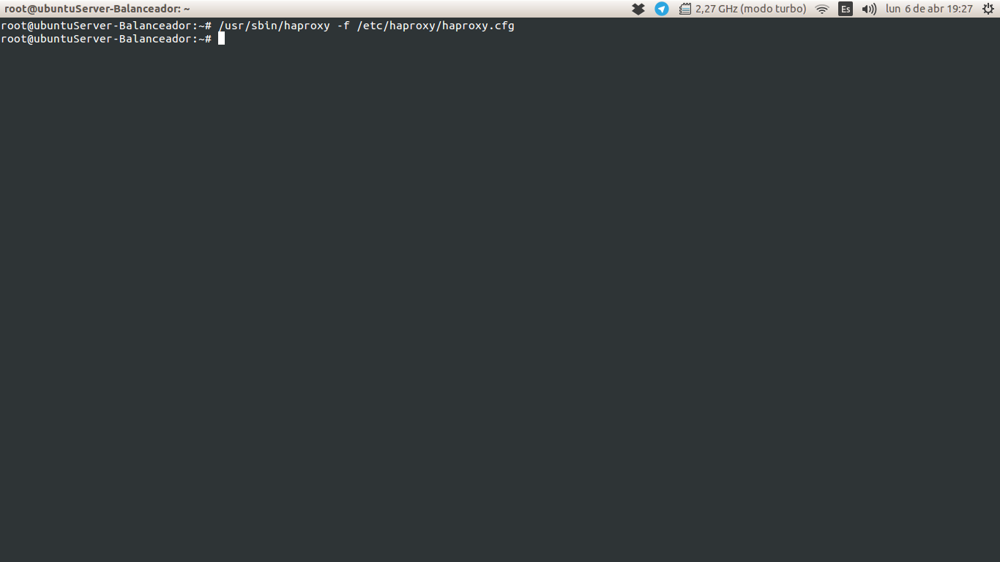

	*Lo probamos mediante:*
	
	`$> curl http://192.168.1.5`

	`$> curl http://192.168.1.5`
	
	**round-robin** 

	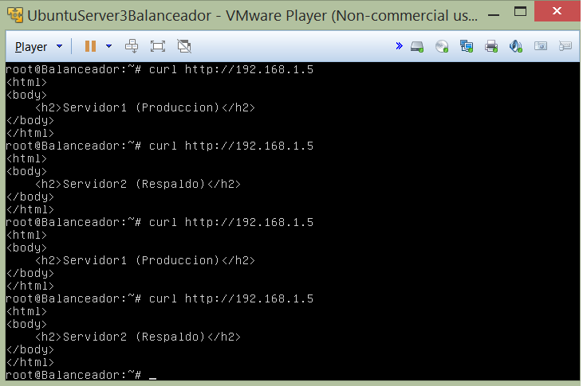

	**Usando ponderación**

	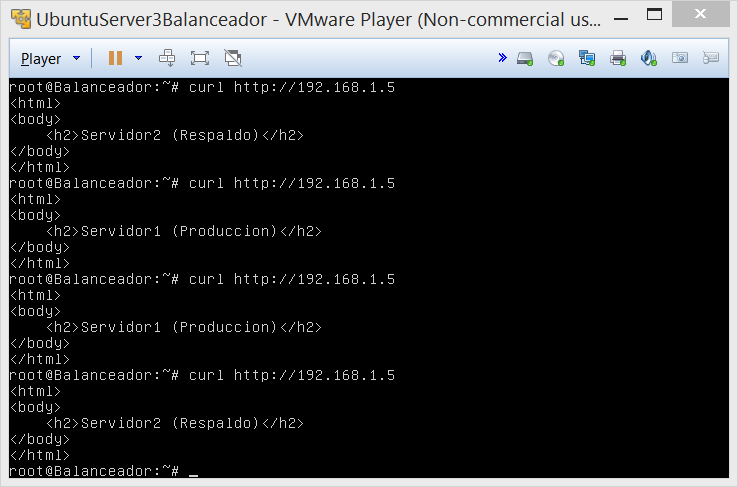

**Autores:** *Alejandro Rodríguez López y Antonio Cordonie Campos*	
		
	

