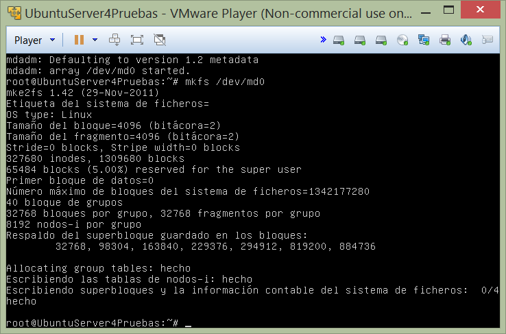
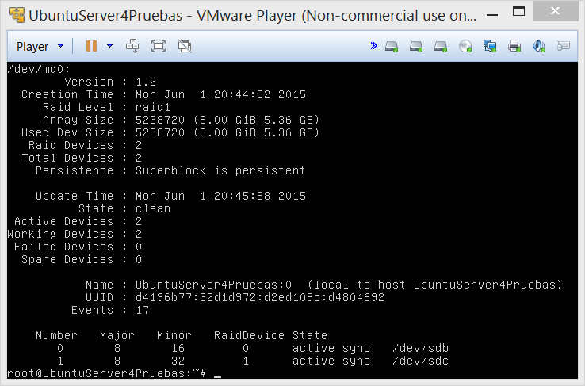
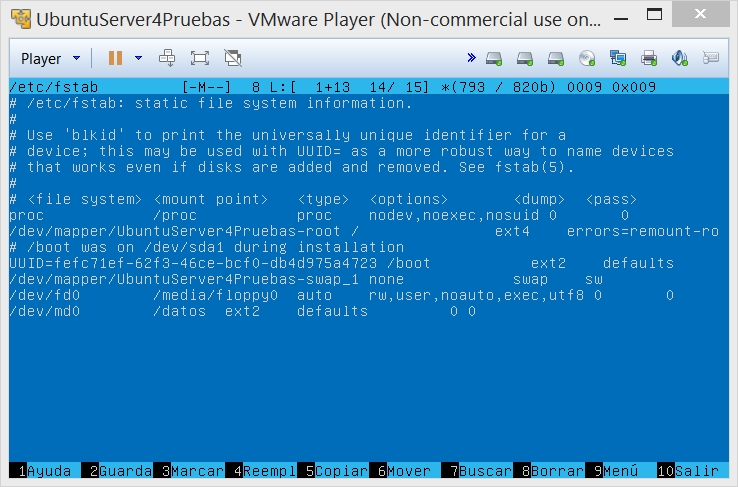
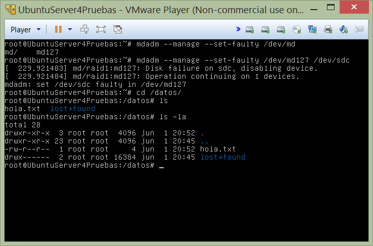
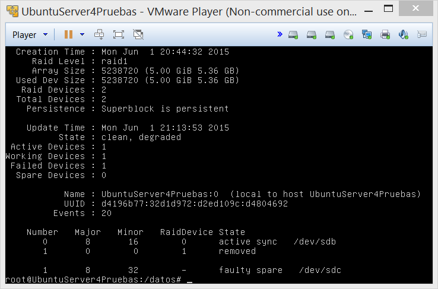
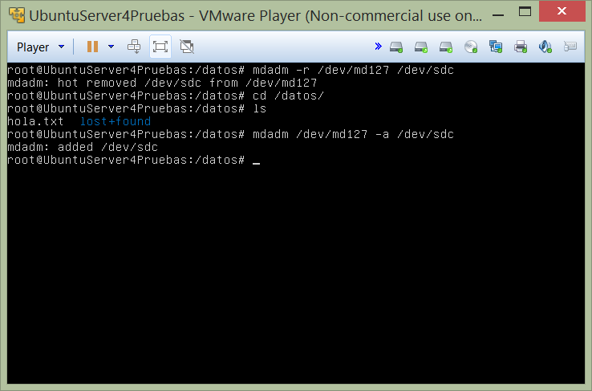
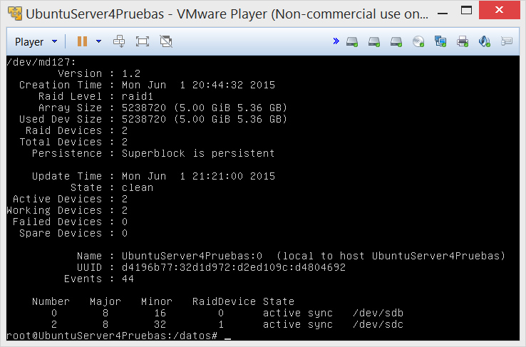

#Práctica 6

1. ###Estructura del entorno virtual.

	**Maquina1:** *192.168.1.10*

2. ###Configuración del RAID por software mdadm:

	*Una vez instalada la herramienta con aptitude install mdadm, configuramos el RAID1 con los 2 discos sdb y sdc. Le damos formato con mkfs /dev/md0*
	
	`mdadm -C /dev/md0 --level=raid1 --raid-devices=2 /dev/sdb /dev/sdc`

	

	*Lo montamos en la carpeta creada con el nombre /datos y listamos los detalles del array*

		`mdadm --detail /dev/md0`
	
	

	*Ponemos el dispositivo en /etc/fstab para que se automonte*
	

	

3. ###Simular que uno de los discos ha fallado (Tarea opcional):

	*Marcamos al disco sdc como fallo. Accedemos a la carpeta /datos y comprobamos que aún estan los datos accesibles*
	
	`mdadm --manage --set-faulty /dev/md127 /dev/sdc`

	

	*Si listamos los detalles del RAID podemos observar como el disco sdc está marcado como faulty spare y en Failed Devices tenemos un 1, indicando que uno de los dos discos del RAID ha fallado*
	

	

	*Borramos el disco sdc del RAID con el comando: *
	
	`mdadm -r /dev/md127 /dev/sdc`

	*Accedemos de nuevo a la carpeta /datos y continuan los datos accesibles*

	

	*Finalmente recuperamos el disco sdc con el comando: *

	`mdadm /dev/md127 -a /dev/sdc`

	*Listamos de nuevo el RAID y ya tenemos el disco sdc recuperado y Acive Devices : 2 *

	

**Autores:** *Alejandro Rodríguez López y Antonio Cordonie Campos*	
		
	

